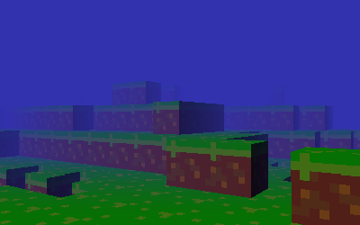

<h1 align="center">Shader Works</h1>
<p align="center">
  <a href="https://github.com/jackwthake/shader-works/actions/workflows/linux-build.yml">
    
  </a>
  <a href="https://github.com/jackwthake/shader-works/actions/workflows/macos-build.yml">
    
  </a>
  <a href="https://github.com/jackwthake/shader-works/actions/workflows/windows-build.yml">
    
  </a>
</p>

<p align="center">
  
  
</p>
<p align="center">
  
  
</p>

A **portable software 3D renderer** written in pure C with zero external dependencies. Renders 2000-3000 triangles at 30-40 FPS on a 2019 MacBook Air without a GPU. Runs on everything from desktop computers to ARM Cortex-M4 microcontrollers.

## Table of Contents
- [Why This Matters](#why-this-matters)
- [Key Features](#key-features)
- [Technical Highlights](#technical-highlights)
- [Quick Start](#quick-start)
- [Demos](#demos)
- [Building](#building)
- [API Reference](#api-reference)

# Why This Matters

**Portability** — Zero dependencies in the core library. No OpenGL, Vulkan, DirectX, or GPU required. Runs identically on Linux, macOS, Windows, and ARM microcontrollers.

**Performance** — Achieves 30-40 FPS rendering 2000-3000 triangles on a 2019 MacBook Air using multi-threaded CPU rasterization. Optimized barycentric coordinate triangle filling with perspective-correct texture mapping.

**Real Applications** — Not just a toy. Powers [Tundra](#tundra), a demo with infinite procedural terrain, dynamic weather, and day/night cycles. [Microcraft](#microcraft) demonstrates the same renderer running on a SAMD51 microcontroller with a 160x128 display.

# Key Features

- **100% Software Rendering** — Complete 3D graphics pipeline from vertex transformation to pixel output with no GPU dependency
- **Fully Portable** — Bring your own framebuffer and pixel format. Library handles the rest
- **Programmable Shaders** — Custom vertex and fragment shaders via function pointers with rich context access
- **Modern Graphics** — Perspective-correct texturing, multi-light support, depth testing, transparency, wireframe mode
- **Multi-threaded** — Optional POSIX threads for parallel rasterization (configurable at build time)
- **Built-in Geometry** — Generators for cubes, spheres, planes, and quads

# Technical Highlights

**Barycentric Rasterization** — Implements scanline-free triangle filling using barycentric coordinates for pixel-perfect coverage testing and smooth attribute interpolation.

**Perspective-Correct Texturing** — Proper depth-aware UV interpolation using 1/w correction prevents texture warping on perspective-projected surfaces.

**Pthread Parallelization** — Work-stealing multi-threaded architecture using atomic operations distributes triangle rasterization across CPU cores for near-linear performance scaling.

**Compiler Optimization Support** — Strategic use of the `restrict` keyword on hot-path function parameters enables advanced compiler optimizations by guaranteeing pointer aliasing constraints, allowing better instruction scheduling and vectorization.

**Embedded Systems Port** — Identical rendering code runs on SAMD51 ARM Cortex-M4 (200MHz, 192KB RAM) by abstracting platform-specific layers (framebuffer, display drivers) while maintaining zero external dependencies.

# Quick Start
```c
#include <shader-works/renderer.h>
#include <shader-works/primitives.h>

// Required: implement color conversion for your target pixel format
uint32_t rgb_to_u32(uint8_t r, uint8_t g, uint8_t b) {
  return (r << 24) | (g << 16) | (b << 8) | 0xFF; // RGBA8888 example
}

void u32_to_rgb(uint32_t color, uint8_t *r, uint8_t *g, uint8_t *b) {
  *r = (color >> 24) & 0xFF; *g = (color >> 16) & 0xFF; *b = (color >> 8) & 0xFF;
}

int main() {
  // Setup window and framebuffer...

  uint32_t framebuffer[WIDTH * HEIGHT];
  float depthbuffer[WIDTH * HEIGHT];
  renderer_t renderer_state = {0};

  init_renderer(&renderer_state, WIDTH, HEIGHT, 0, 0,
                framebuffer, depthbuffer, MAX_DEPTH);

  transform_t camera = {0};
  update_camera(&renderer_state, &camera);

  model_t cube = {0};
  generate_cube(&cube, make_float3(0, 0, -5), make_float3(1, 1, 1));

  while (running) {
    // Clear buffers
    for(int i = 0; i < WIDTH * HEIGHT; ++i) {
      framebuffer[i] = 0x000000;
      depthbuffer[i] = FLT_MAX;
    }

    render_model(&renderer_state, &camera, &cube, NULL, 0);

    // Present framebuffer to screen...
  }

  delete_model(&cube);
  return 0;
}
```

# Demos

## Tundra


An explorable infinite world featuring:
- **Infinite procedural terrain** using Perlin noise
- **Dynamic day/night cycle** with atmospheric color transitions
- **Real-time snow particles** with physics simulation
- **Chunk-based streaming** and an **FSM-driven architecture** for seamless exploration and state management

Demonstrates the renderer's capability to handle complex scenes with thousands of triangles, dynamic lighting, and environmental effects.

**Tech:** Uses cJSON for configuration. See [demos/tundra/](demos/tundra/) for details.

## Microcraft


The same 3D renderer **running on a SAMD51 ARM Cortex-M4 microcontroller** (200MHz, 192KB RAM) with a 160x128 LCD display.

Proves true portability — identical rendering code runs on both desktop and embedded hardware with zero GPU dependency. Features voxel-style world rendering at playable framerates on resource-constrained hardware.

**Tech:** Custom SAMD51 drivers, UF2 bootloader deployment. See [demos/microcraft/](demos/microcraft/)

# Building

## Quick Build (Recommended)
```bash
# Clone with submodules
git clone --recursive https://github.com/jackwthake/shader-works
cd shader-works

# Or if already cloned, initialize submodules
git submodule update --init --recursive

# Quick single configuration builds
./quick_build.sh release threads           # Multi-threaded release (best performance)
./quick_build.sh debug nothreads           # Single-threaded debug (easier debugging)
./quick_build.sh release                   # Uses defaults: release with threading

# Build all configurations at once
./build_all.sh                             # Builds all 4 variants (debug/release × threaded/single)

# Run the demo
./build/bin/basic_demo                     # After quick_build.sh
# Or run specific configurations after build_all.sh:
# ./build-release-threaded/bin/basic_demo  # Release multi-threaded
# ./build-debug-single/bin/basic_demo      # Debug single-threaded
```

## Manual CMake Build
```bash
# Configure with threading options
mkdir build && cd build
cmake -DCMAKE_BUILD_TYPE=Release -DSHADER_WORKS_USE_THREADS=ON ..
cmake --build . -j 8 && ./bin/basic_demo

# Library-only build (no examples - useful for integration)
cmake -DCMAKE_BUILD_TYPE=Release -DSHADER_WORKS_BUILD_EXAMPLES=OFF ..
cmake --build . -j 8
```

### Build Options
- `SHADER_WORKS_USE_THREADS=ON/OFF` - Enable/disable multi-threaded rendering (default: ON)
- `SHADER_WORKS_BUILD_EXAMPLES=ON/OFF` - Build example programs (default: ON)
- `SHADER_WORKS_MULTI_CONFIG=ON/OFF` - Build multiple configurations (default: OFF)

### Platform Support
Works on Linux, macOS, Windows (MinGW/MSVC), and ARM microcontrollers. Build requirements: C11 compiler, CMake 3.15+. Demos require SDL3 (included as submodule).

# API Reference

## renderer.h
### Required Client Functions

```c
u32 rgb_to_u32(u8 r, u8 g, u8 b);
void u32_to_rgb(u32 color, u8 *r, u8 *g, u8 *b);
```
Client must implement these for pixel format conversion. Allows renderer to be pixel-format agnostic.

### Core Renderer Functions
```c
void init_renderer(renderer_t *state, u32 win_width, u32 win_height,
                   u32 atlas_width, u32 atlas_height, u32 *framebuffer,
                   f32 *depthbuffer, f32 max_depth);
```
Initialize renderer with client-provided buffers. Framebuffer and depthbuffer must be pre-allocated arrays of `win_width * win_height` elements.

---
```c
void update_camera(renderer_t *state, transform_t *cam);
```
Update camera basis vectors based on transform (position + yaw/pitch). Call before rendering.

---
```c
usize render_model(renderer_t *state, transform_t *cam, model_t *model,
                   light_t *lights, usize light_count);
```
Render model with threading support. Returns number of triangles rendered. Handles vertex transformation, rasterization, and shading.

---
```c
void apply_fog_to_screen(renderer_t *state, f32 fog_start, f32 fog_end,
                         u8 fog_r, u8 fog_g, u8 fog_b);
```
Apply depth-based fog effect to entire framebuffer. Fog interpolates between `fog_start` and `fog_end` distances.

---
## primitives.h

### Data Structures
Use the `model_t` structure to store model data for use with the renderer. Vertices must be in Counter-Clockwise Winding (CCW) order for proper back-face culling.
```c
typedef struct {
  vertex_data_t *vertex_data;     // Position, UV, normal per vertex
  float3 *face_normals;           // Per-triangle normals for back-face culling
  usize num_vertices, num_faces;

  transform_t transform;          // Position, yaw, pitch
  bool use_textures;              // If false, use flat shading

  vertex_shader_t *vertex_shader;
  fragment_shader_t *frag_shader;
} model_t;
```


### Geometry Generation
```c
// Generator functions
int generate_cube(model_t* model, float3 position, float3 size);
int generate_sphere(model_t* model, f32 radius, int segments, int rings, float3 position);
int generate_plane(model_t* model, float2 size, float2 segment_size, float3 position);
int generate_quad(model_t* model, float2 size, float3 position);
void delete_model(model_t* model);
```

All generators allocate and populate model with vertices, normals, and UV coordinates. Return 0 on success. **cube**: axis-aligned box. **sphere**: UV sphere with configurable tessellation. **plane**: subdivided for displacement effects. **quad**: simple 2-triangle surface. Always call `delete_model()` to free memory.

## shaders.h

### Shader Creation

```c
vertex_shader_t make_vertex_shader(vertex_shader_func func, void *argv, usize argc);
fragment_shader_t make_fragment_shader(fragment_shader_func func, void *argv, usize argc);
```
Create custom shaders with user-defined arguments. Arguments are passed to shader function on every invocation.

### Shader Function Signatures

```c
typedef float3 (*vertex_shader_func)(vertex_context_t *context, void *args, usize argc);
typedef u32 (*fragment_shader_func)(u32 input_color, fragment_context_t *context, void *args, usize argc);
```

**Vertex shaders** transform vertices from model space and return modified position. Context provides camera data, original vertex info, and timing.

**Fragment shaders** process pixels and return final color. Return `rgb_to_u32(255, 0, 255)` to discard pixel for transparency.

### Built-in Shaders

```c
extern vertex_shader_t default_vertex_shader;           // Standard MVP transformation
extern fragment_shader_t default_frag_shader;           // Textured
extern fragment_shader_t default_lighting_frag_shader;  // Multi-light support
```

### Context Structures
The shader system provides extensive programmability through rich context structures and user-defined parameters. Context structures expose render pipeline data while custom parameter buffers enable dynamic effects with game data.
**fragment_context_t** provides:
- `world_pos`, `screen_pos`, `uv`, `depth` - spatial information
- `normal`, `view_dir` - lighting vectors
- `time` - for animations
- `light`, `light_count` - scene lighting

**vertex_context_t** provides:
- Camera vectors (`cam_position`, `cam_forward`, `cam_right`, `cam_up`)
- Projection parameters (`projection_scale`, `frustum_bound`, `screen_dim`)
- Original vertex data (`original_vertex`, `original_uv`, `original_normal`)
- Indices (`vertex_index`, `triangle_index`) and timing (`time`)

### Lighting
Can be used within fragment shaders to add lighting effects. Use `default_lighting_frag_shader` for basic diffuse lighting with no shadows.
```c
typedef struct {
  float3 position, direction;
  u32 color;
  bool is_directional;  // true = directional light, false = point light
} light_t;
```
