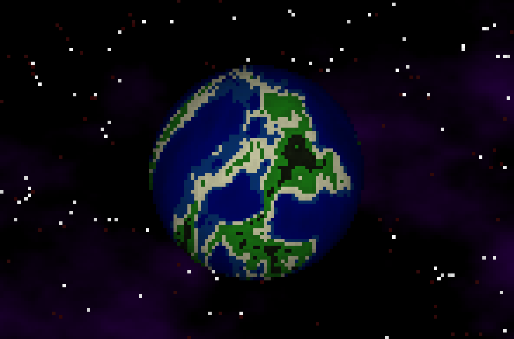
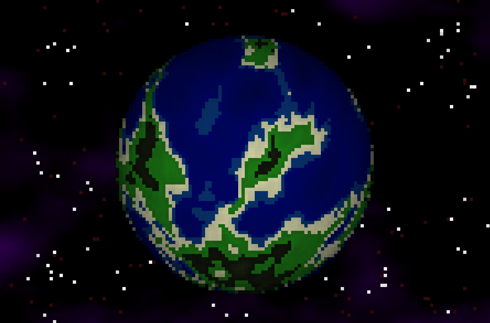

# Planets

<p align="center">
  
  
</p>

**Procedurally generated planets rendered with diffuse lighting and seamless textures.**

A real-time demonstration of procedural texture generation and planet rendering using the `shader-works` software renderer. Each planet features unique terrain, oceans, and a randomized star field background with realistic distance-based redshift.

## What It Demonstrates

**Procedural Texture Generation** — Uses Perlin noise (fractal Brownian motion) combined with ridge noise to create detailed, believable planetary surfaces with water, beaches, grassland, mountains, and snow.

**Seamless Texture Wrapping** — Implements polar coordinate sampling to ensure perfect horizontal wrapping on rotating planet surfaces with no visible seams.

**Diffuse Lighting** — Real-time Lambertian shading with randomized sun color and direction for dynamic lighting on rotating spheres.

**Procedural Starfield** — Generates a starry background where closer stars appear bright white while distant stars fade to red (cosmological redshift effect).

## Features

- Infinite procedural planet generation
- Smooth terrain with multiple biome types (deep water, shallow water, beach, grassland, mountains, snow)
- Seamless horizontal texture tiling
- Real-time planet rotation with dynamic lighting
- Procedurally generated starfield with redshift effect
- Randomized sun colors and directions for visual variety
- High-resolution surface texture (200x200)

## Controls

| Key | Action |
|-----|--------|
| SPACE | Generate new planet |
| ESC | Exit |

## Implementation Details

**Terrain Generation** — Combines two noise types for interesting features:
- Fractal Brownian Motion (fBm) — provides rolling terrain variation
- Ridge Noise — creates sharp mountain peaks and dramatic elevation changes
- Contrast curve (power function) — emphasizes extremes for more pronounced peaks and valleys

**Texture Biome Mapping** — Normalized noise values are mapped to terrain types:
- 0.0-0.3: Deep ocean (dark blue)
- 0.3-0.4: Shallow water (cyan)
- 0.4-0.5: Beach (tan)
- 0.5-0.6: Grassland (green)
- 0.6-0.8: Mountains (gray)
- 0.8-1.0: Snow peaks (white)

**Seamless Wrapping** — The horizontal axis uses polar coordinates:
```c
float angle = x / TEXTURE_SIZE * 2π
float x_coord = cos(angle) * scale
float y_coord = sin(angle) * scale + y_offset
```
This makes x=0 and x=TEXTURE_SIZE sample the same position on a circle, ensuring perfect wrapping when the planet rotates.

**Starfield Simulation** — Ridge noise identifies star positions, then distance-based coloring creates:
- Close stars (distance < 0.5): Bright white
- Distant stars (distance ≥ 0.5): Dim red-shifted appearance

**Rendering Pipeline** — Each frame:
1. Render procedural starfield background (filling depth buffer with max depth)
2. Render lit planet surface on top (with proper depth comparison)
3. Apply Lambertian diffuse shading using light direction and surface normal
