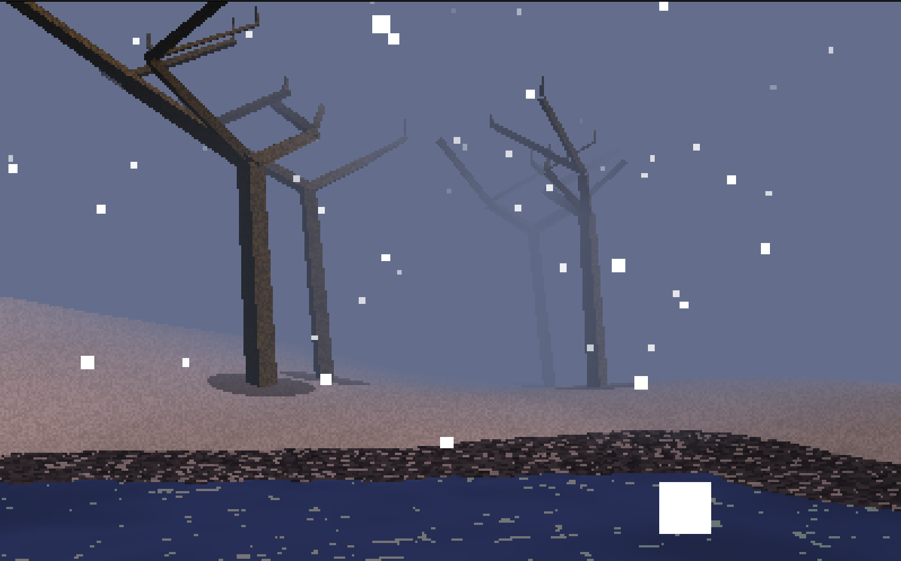
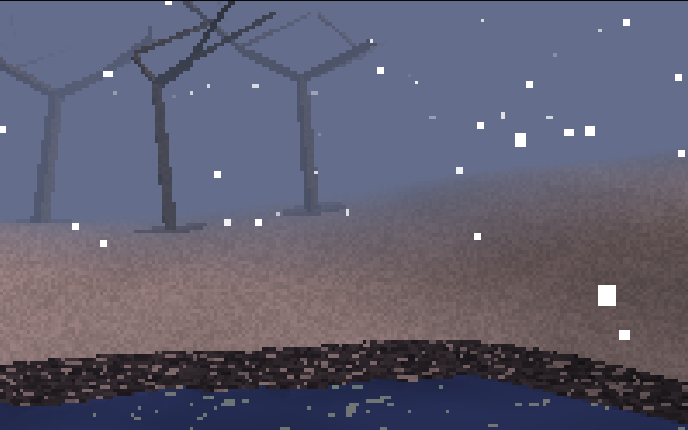

# Tundra

| | |
|:-------------------------:|:-------------------------:
|  | 
|  |

**An infinite explorable world rendered entirely in software.**

Built with the `shader-works` renderer to demonstrate real-world performance and capability. Features procedural terrain generation, real-time weather, and atmospheric effects — all running at 30-40 FPS on modest hardware.

## What It Demonstrates

**Complex Scene Management** — Handles 2000-3000 triangles per frame with chunk-based streaming and frustum culling.

**Dynamic Lighting** — Day/night cycle affects sun color, fog color, and ambient lighting in real-time.

**Environmental Effects** — Particle-based snow system with physics simulation and wind.

**Procedural Generation** — Infinite terrain using Perlin noise. Generates rolling hills, frozen lakes, gravel shores, and tree placement on the fly.

## Features

- Infinite procedural terrain generation
- 2-minute day/night cycle with atmospheric color transitions
- Real-time snow particle system
- Dynamic fog rendering
- Chunk-based world streaming
- First-person and overhead camera modes
- Wireframe debug view

## Controls

| Key | Action |
|-----|--------|
| W/A/S/D | Move |
| 1 | First-person view (default) |
| 2 | Birds-eye view |
| ESC | Exit |

## Building

```bash
# From shader-works root
./quick_build.sh release threads

# Run demo
./build/bin/tundra
```

Built with SDL3 for windowing and cJSON for configuration. Both included as submodules.

## Architecture

**Finite State Machine** — Built on a clean FSM architecture (`state.c`/`state.h`) that manages game states with lifecycle callbacks:
- **GENERATE** — Initial world generation and setup
- **NORMAL** — First-person exploration mode
- **OVERHEAD** — Birds-eye camera view

Each state implements `enter`, `tick`, `render`, and `exit` callbacks, enabling clean separation of concerns and easy state transitions. The FSM shares a common game context across all states, allowing seamless data flow while maintaining modular state logic.

**Chunk Hash Map** — Uses a spatial hash table (`chunk_map.c`/`chunk_map.h` from `demos/common`) to efficiently manage loaded terrain chunks:
- Hash function: `((x * 73856093) ^ (z * 19349663)) % table_size`
- Chained collision resolution with linked lists
- Each chunk stores ground plane geometry and tree models
- Supports conditional queries via callback functions (e.g., frustum culling, distance-based unloading)
- O(1) average insertion, lookup, and removal

The chunk map enables infinite world streaming by dynamically loading chunks near the player and unloading distant ones, keeping memory usage constant regardless of how far you explore.

**Configuration** — Uses cJSON to parse `config.json` for window settings, world generation parameters (seed, chunk size, load radius), and rendering options.
